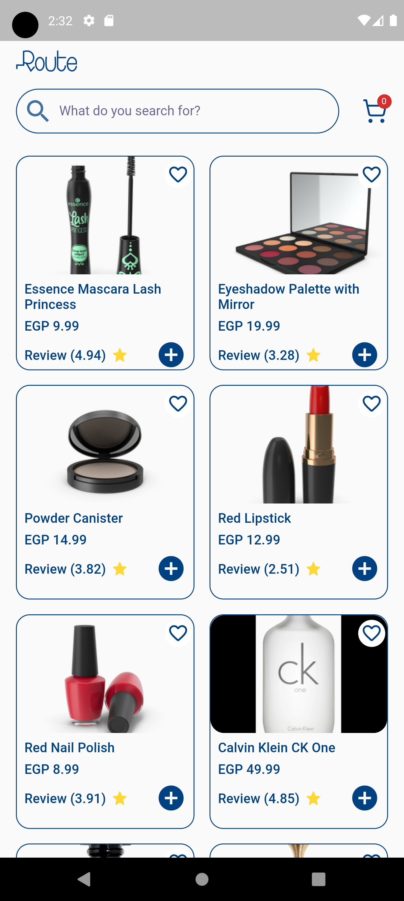
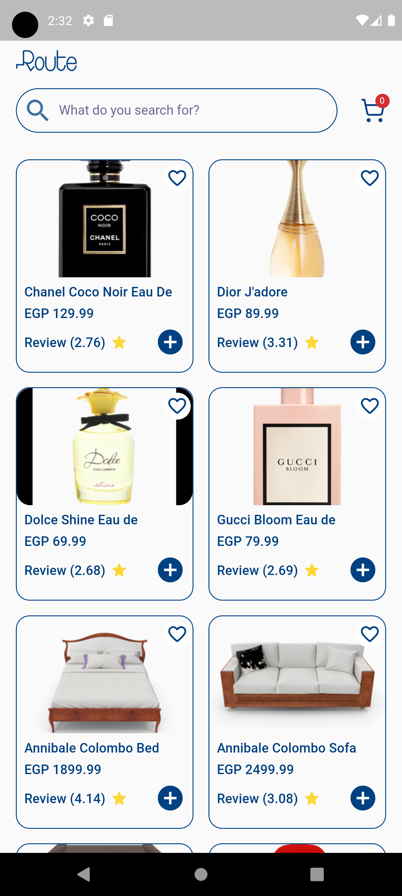
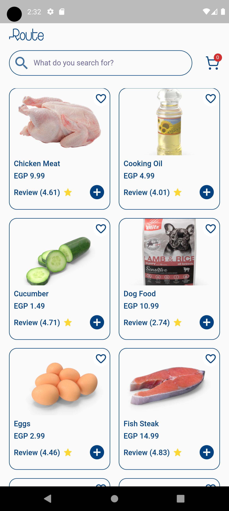
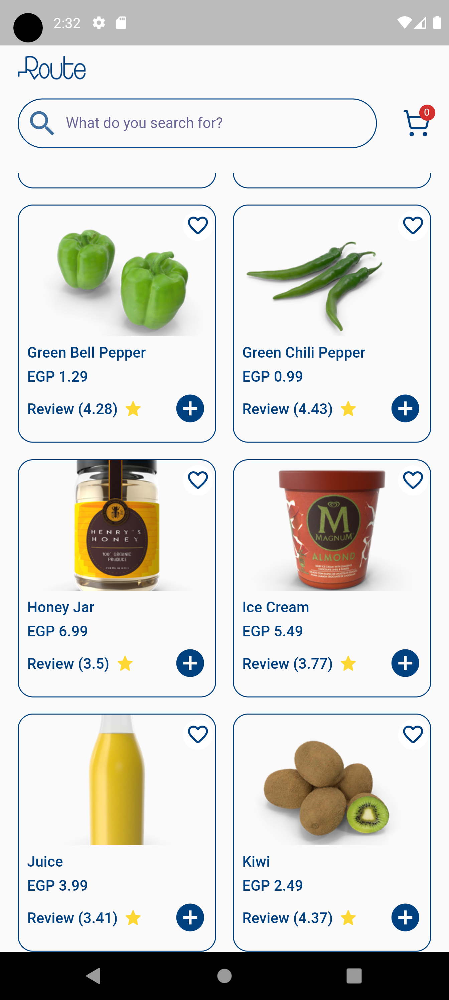

# Route Task

A flutter screen which displayes products List from a dummy data Api.


## API Reference

#### Get all items

```http
  GET / 'https://dummyjson.com/products'
```


## Documentation

I used Clean Architecture and Cubit state management 

## Screenshots








## Running Tests

To run tests, run the following command

```bash
  flutter test
```

